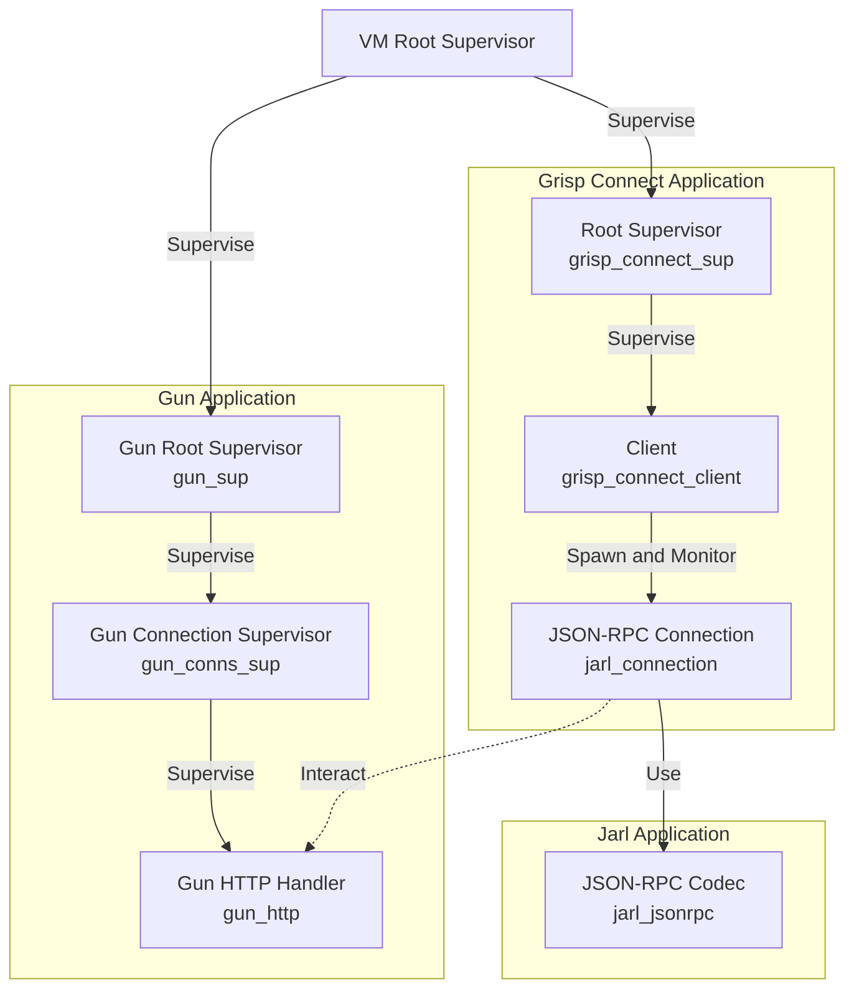

# Architecture

## Client

The client process is the main state machine. Its responsabilities are:

 - Trigger connection/reconnection to the backend.
 - Expose high-level protocol API to the application.
 - Implement generic API endpoints.

See the [client documentation](grisp_connect_client.md).

## Connection

grisp_connect use the jarl library to handle the JSON-RPC connection.

It is not supervised, the process starting it must monitor it.

It provides a high-level API to a JSON-RPC connection:

 - Perform synchronous requests
 - Start asynchronous requests
 - Reply to a request
 - Send an error result for a request
 - Send asynchronous notifications

When performing an asynchronous request, the caller can give an opaque context
term, that will be given back when receiving a response or an error for this
request, allowing the caller to handle the asynchronous operation without having
to store information locally.
