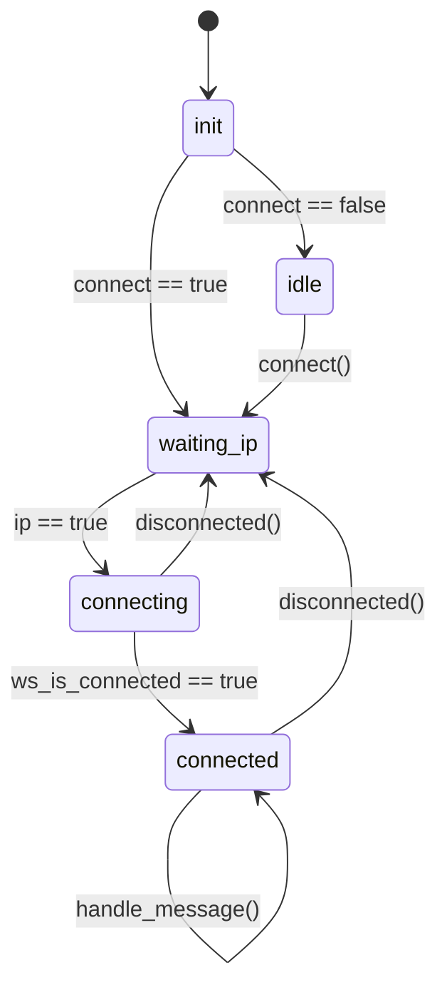

```mermaid
stateDiagram-v2
    [*] --> init
    init --> waiting_ip: connect == true
    init --> idle: connect == false

    idle --> waiting_ip: connect()
    waiting_ip --> connecting: ip == true
    connected --> waiting_ip: disconnected()
    connected --> connected: request()
    connected --> connected: handle_message()
    connecting --> connected: ws_is_connected == true
    connecting --> waiting_ip: disconnected()

```
