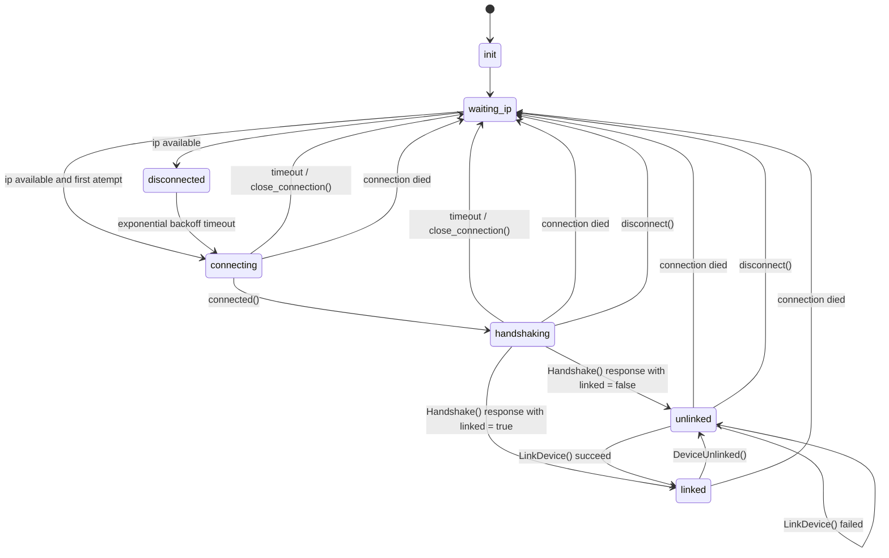

# Client

## State Diagram

```mermaid
stateDiagram
  direction TB
  [*] --> init
  init --> waiting_ip
  waiting_ip --> connecting:ip available and first atempt
  waiting_ip --> disconnected:ip available
  disconnected --> connecting:exponential backoff timeout
  connecting --> waiting_ip:timeout / close_connection()
  connecting --> waiting_ip:connection died
  connecting --> handshake:connected()
  handshake --> waiting_ip:timeout / close_connection()
  handshake --> waiting_ip:connection died
  handshake --> waiting_ip:disconnect()
  handshake --> unlinked:Handshake() response with linked = false
  unlinked --> waiting_ip:connection died
  unlinked --> waiting_ip:disconnect()
  handshake --> connected:Handshake() response with linked = true
  connected --> unlinked:DeviceUnlinked()
  connected --> waiting_ip:connection died
  unlinked --> connected:LinkDevice() succeed
  unlinked --> unlinked:LinkDevice() failed
  handshake:handshaking
  connected:linked
```
