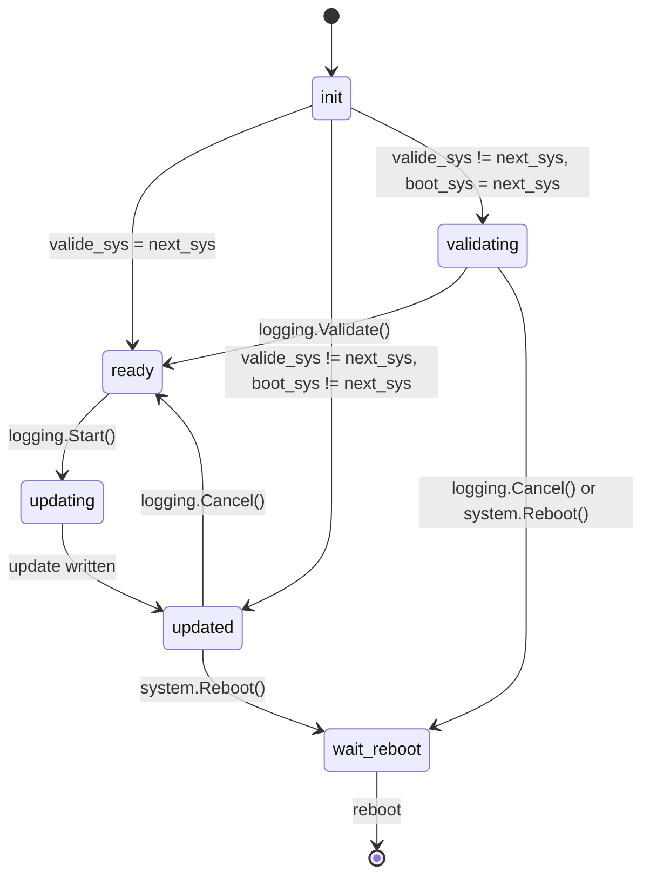

# Software Update Feature

## State Diagram

## Protocol

When the server connects, after the handshake with the `"update"` feture
enabled and if the device is already linked, it will always send a
`"logging.Progress"` notification. If not linked, it will send the notification
after a successfull `"LinkDevice"` request.

In addition, a `"logging.Progress"` notification will be sent for every state
change, and durring the state `"updating"`, it will periodically be sent with
progress information and in case there is an important warning regarding the
update process.